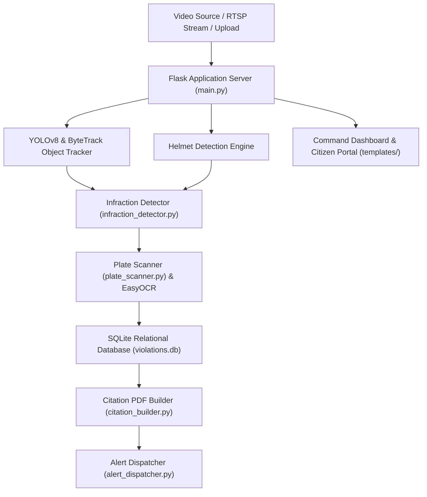

# TrafficSentinel AI — Vision-Powered Traffic Safety & Automated Enforcement System

**TrafficSentinel AI** is an advanced, production-grade computer vision platform designed for real-time traffic monitoring, vehicle tracking, rider compliance detection, counterflow/wrong-way detection, and automatic license plate recognition (ALPR).

Equipped with automated e-citation generation, multi-channel citizen notifications (Email & WhatsApp), and an interactive command dashboard, **TrafficSentinel AI** delivers end-to-end smart city traffic enforcement.

---

##  Key Capabilities & Feature Highlights

- **Real-Time Video Stream Pipeline**: Supports RTSP/HTTP live network streams, webcam feeds, and multi-format video file uploads (`.mp4`, `.avi`, `.mov`, `.mkv`).
- **Deep Learning Object Tracking**: Powered by YOLOv8 vision backbones and ByteTrack multi-object tracking for accurate trajectory and spatial analysis.
- **Helmet Compliance Monitoring**: Real-time detection identifying unhelmeted motorcycle riders and passengers.
- **Triple-Riding Overlap Analyzer**: Spatial bounding box overlap analysis identifying three or more riders on two-wheeled motor vehicles.
- **Counterflow / Wrong-Way Detection**: Dual-mode trajectory tracking evaluating vertical motion vector decrease and bounding box growth rate.
- **ALPR & License Plate OCR**: Sub-region detection and EasyOCR processing with pattern normalization for Indian vehicular registration standards.
- **Automated E-Citation Generation**: PDF citation building via ReportLab with embedded evidence frames, QR codes for instant online settlement, and progressive multipliers for repeat offenders.
- **Multi-Channel Alert Dispatcher**: Integrated email (Gmail SMTP) and WhatsApp (Meta Graph API) notification services.
- **Administrative Command Center**: Web interface with real-time video streaming, live metrics, filterable infraction history, and CSV data export.
- **Public Citizen Safety Portal**: Masked plate lookup, citation status checking, fine collection transparency, and community safety analytics.

---
##  System Architecture



---

##  Repository Structure

```text
traffic-monitoring/
├── main.py                  # Primary Flask application server & stream orchestrator
├── config.py                # System-wide configuration & environment variable loader
├── infraction_detector.py   # Spatial logic & trajectory tracking for traffic violations
├── plate_scanner.py         # License plate recognition & regex pattern normalization
├── citation_builder.py      # ReportLab PDF citation builder with QR payment generator
├── alert_dispatcher.py      # Email (SMTP) & WhatsApp notification service
├── registry_lookup.py       # National vehicle registration database service
├── process_images.py        # CLI batch image processing pipeline
├── process_videos.py        # CLI batch video processing pipeline
├── model_evaluator.py       # Model loading & benchmark evaluation tool
├── populate_db.py           # Database seeding script for demo data
├── requirements.txt         # Python dependency manifest
├── Dockerfile               # Production container image manifest
├── docker-compose.yml       # Multi-container orchestration specification
├── .env.example             # Environment variable template
├── models/                  # Neural network weights
│   ├── yolov8s.pt           # Vehicle detection backbone
│   ├── best.pt              # Helmet compliance model
│   └── Plate.pt             # License plate detection model
├── data/                    # Video storage directories
│   ├── input_videos/        # Uploaded video storage
│   └── test_videos/         # Test benchmark clip storage
├── outputs/                 # Processing output storage
│   └── video_results/       # Annotated output video clips
├── static/                  # Static web assets & generated PDFs
│   ├── screenshots/         # Captured evidence frames
│   └── challans/            # Generated PDF citations
├── templates/               # Web application templates
│   ├── index.html           # Command Center Dashboard
│   ├── login.html           # Administrator Login Interface
│   ├── analytics.html       # Analytics & Charts Interface
│   └── citizen.html         # Public Citizen Portal
└── tests/                   # Automated test suite
    └── test_infractions.py  # Unit tests for core algorithms
```

---

##  Installation & Setup

### 1. Prerequisites
- Python 3.10+ installed
- Git installed

### 2. Environment Setup
```bash
# Clone repository
git clone <repository-url>
cd "traffic monitoring"

# Create virtual environment
python -m venv venv

# Activate virtual environment
# Windows:
.\venv\Scripts\activate
# Linux/macOS:
source venv/bin/activate

# Install required dependencies
pip install -r requirements.txt
```

### 3. Configuration File
Copy the configuration template to `.env`:
```bash
cp .env.example .env
```
Key configuration parameters in `.env`:
- `ADMIN_PASSWORD`: Command center login password (default: `admin123`)
- `PORT`: Web server port (default: `5001`)
- `SECRET_KEY`: Flask session security secret

---

##  Running the Application

### Start Web Application Server
```bash
python main.py
```
Open your browser and navigate to:
- **Command Center Dashboard**: [http://localhost:5001/](http://localhost:5001/) (Default login password: `admin123`)
- **Analytics Center**: [http://localhost:5001/analytics](http://localhost:5001/analytics)
- **Public Citizen Portal**: [http://localhost:5001/citizen](http://localhost:5001/citizen)

### Batch Processing CLI Tools
- **Process Images**: `python process_images.py`
- **Process Videos**: `python process_videos.py`
- **Evaluate Models**: `python model_evaluator.py`
- **Seed Database**: `python populate_db.py`
- **Run Unit Test Suite**: `python -m pytest tests/ -v`

---


